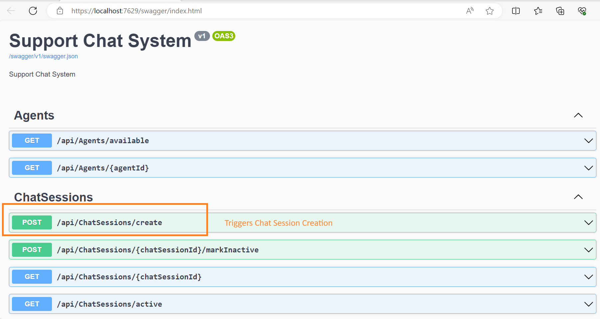
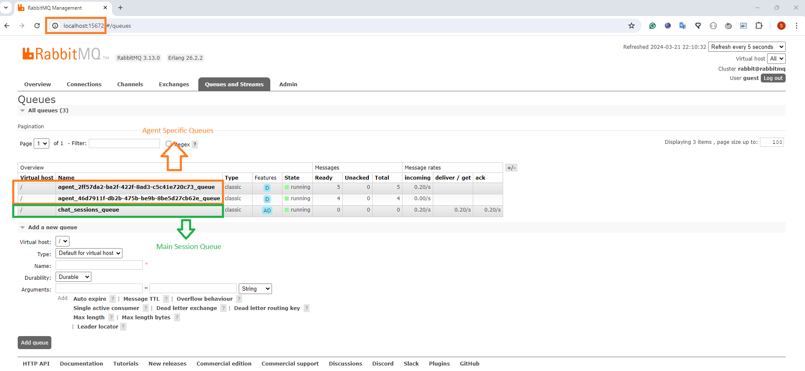

# SupportChatSystem

SupportChatSystem is a support chat application that handles customer support interactions. Developed with .NET 8 and C#, this solution leverages the principles of SOLID, Clean Architecture, CQRS, and DDD to ensure a well-structured, scalable, and maintainable codebase. It utilizes RabbitMQ for efficient message queuing and employs an in-memory database via Entity Framework Core, facilitating rapid development and testing.

## Getting Started

Follow these steps to get your local development environment up and running:

### 1. Clone the Repository

To clone the repository and navigate into it, run:

```bash
git clone https://github.com/donmezs/SupportChatSystem.git
```

### 2. Install .NET 8 SDK and Docker

Ensure you have the [.NET 8 SDK](https://dotnet.microsoft.com/en-us/download/dotnet/8.0) installed on your machine. Also, make sure you have [Docker](https://docs.docker.com/get-docker/) installed to manage the RabbitMQ container.

### 3. Launch RabbitMQ Using Docker Compose

Navigate to the project directory where `docker-compose.yml` is located and run:

```bash
docker-compose up -d
```

This command starts RabbitMQ in a Docker container. The `-d` flag runs the container in the background.

### 4. Run the Project

With RabbitMQ running, you can now start the SupportChatSystem API. Navigate to the API project directory and run:

```bash
dotnet run
```

This command compiles and runs the API project. If you are using Visual Studio you can run it directly.

### 5. Explore the API with SwaggerUI

After starting the API, navigate to [https://localhost:7629/swagger/index.html](https://localhost:7629/swagger/index.html) in your web browser to access SwaggerUI.

### 6. Monitor Queues Using RabbitMQ Management Console

Access the RabbitMQ Management Console at [http://localhost:15672](http://localhost:15672) to monitor queues and message flow. The default credentials for the management console are:

- **Username**: guest
- **Password**: guest

You can now send requests through SwaggerUI and observe how chat sessions are queued and processed by the system, as well as how messages flow through RabbitMQ.

By following these steps, you should have a fully operational instance of the SupportChatSystem running locally, ready for further development or testing.

## Sample Assets



